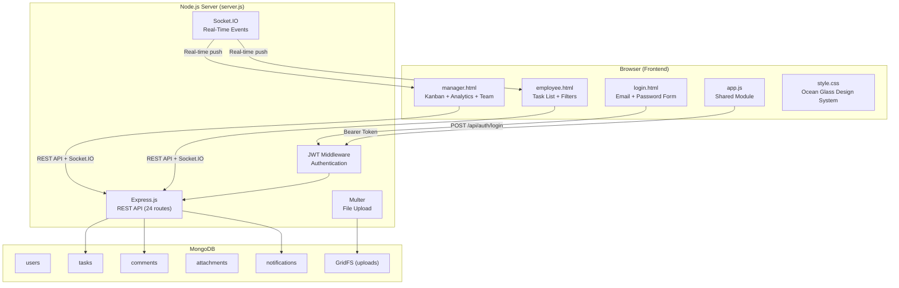
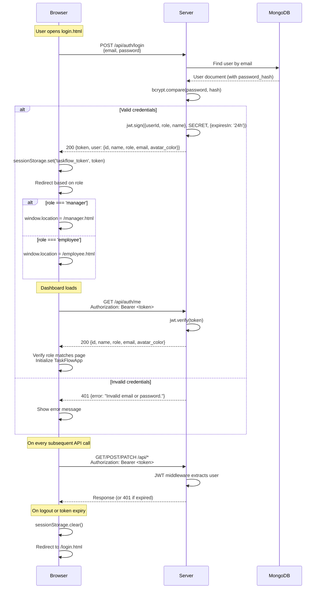
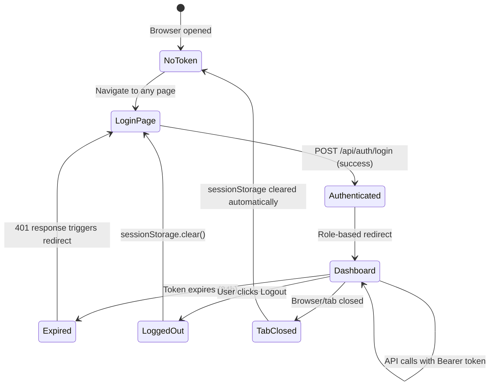
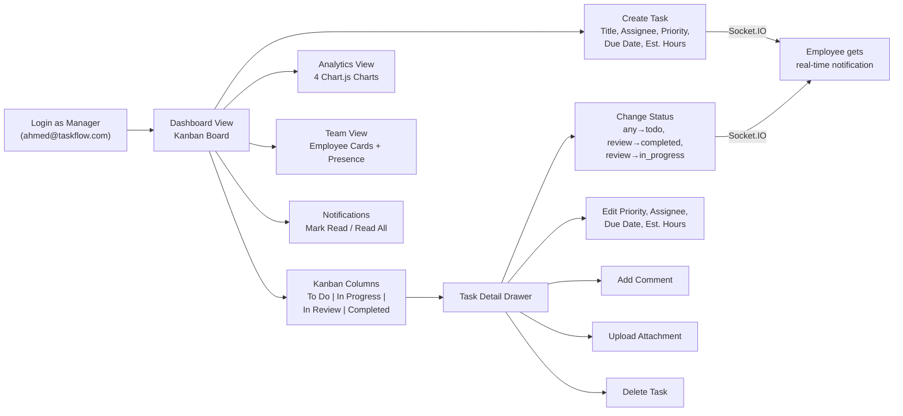
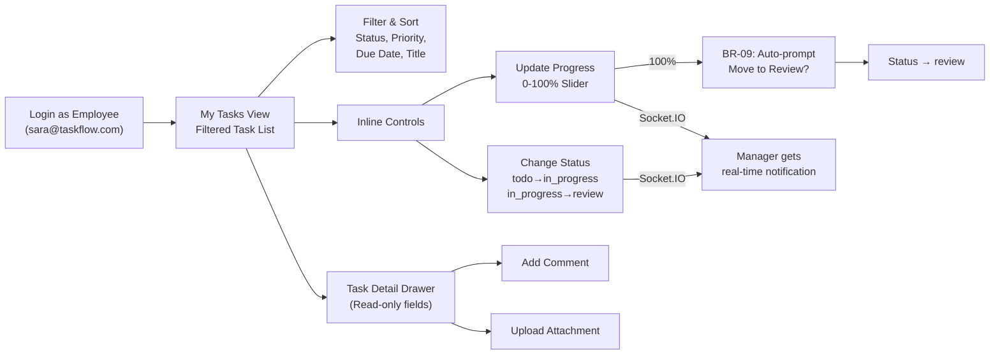
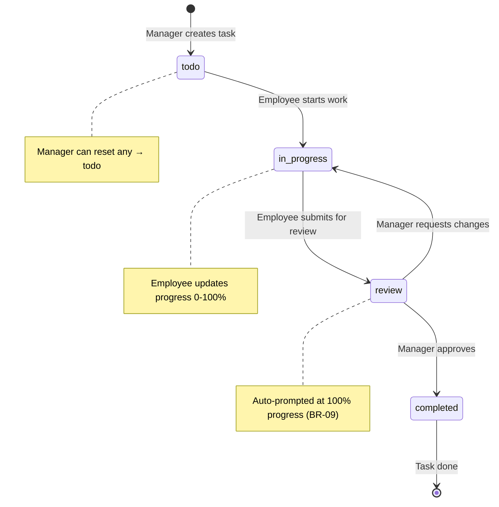
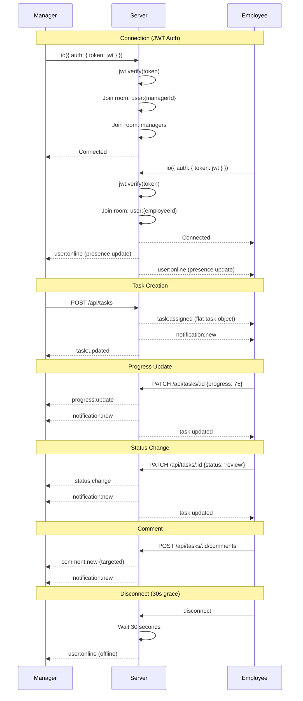
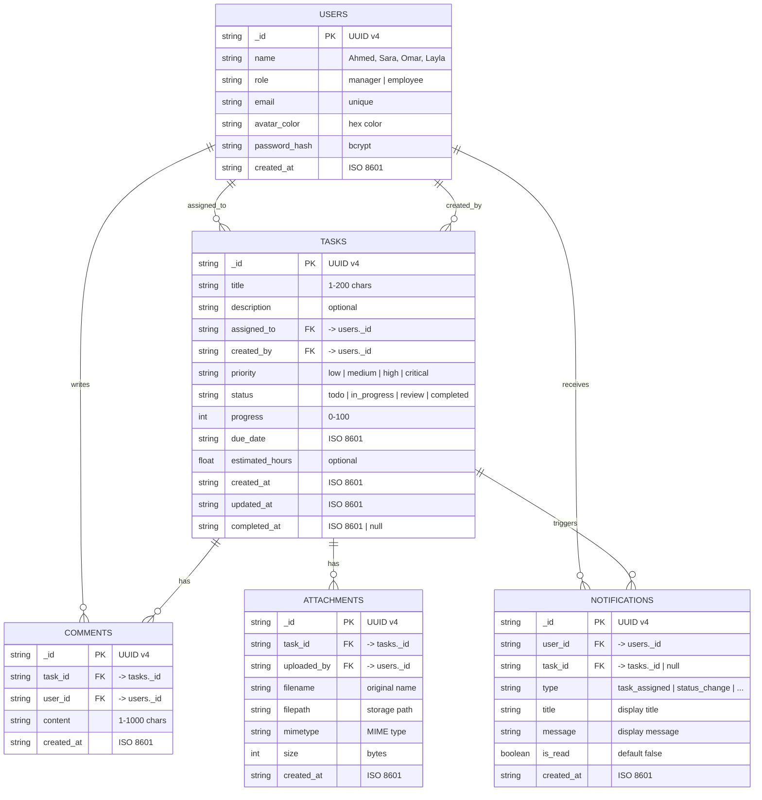

# TaskFlow - Real-Time Task Management System

A lightweight, real-time task management web application built for small teams: **1 Manager + 3 Employees**. Designed as a focused alternative to Jira/Asana with live updates, role-based dashboards, and a glassmorphism UI.

---

## Table of Contents

- [Features](#features)
- [Tech Stack](#tech-stack)
- [Architecture Overview](#architecture-overview)
- [Authentication Flow](#authentication-flow)
- [Application Flow](#application-flow)
- [Real-Time Events](#real-time-events)
- [Database Schema](#database-schema)
- [API Reference](#api-reference)
- [Project Structure](#project-structure)
- [Getting Started](#getting-started)
- [Environment Variables](#environment-variables)
- [Default Users](#default-users)
- [Business Rules](#business-rules)
- [Design System](#design-system)

---

## Features

- **Role-based dashboards** — Manager gets Kanban board + analytics; Employees get task list + inline controls
- **JWT authentication** — Email + password login with bcrypt-hashed passwords
- **Real-time updates** — Socket.IO pushes task changes, comments, and presence to all connected clients
- **Task lifecycle** — Create, assign, update status/priority/progress, comment, attach files, delete
- **Analytics dashboard** — Doughnut, bar, pie, and line charts (Chart.js) for the manager
- **File attachments** — Uploaded via Multer, stored in MongoDB GridFS
- **Toast notifications** — Color-coded, auto-dismissing alerts with Web Audio API chimes
- **Online presence** — Green dots on team cards with 30-second disconnect grace period
- **Ocean Glass UI** — Glassmorphism design system with animated gradient mesh background

---

## Tech Stack

| Layer | Technology |
|-------|-----------|
| **Runtime** | Node.js |
| **Server** | Express.js |
| **Database** | MongoDB (with GridFS for file storage) |
| **Real-Time** | Socket.IO |
| **Auth** | JWT (jsonwebtoken) + bcryptjs |
| **File Upload** | Multer (memory storage -> GridFS) |
| **Frontend** | Vanilla HTML/CSS/JS (no framework) |
| **Charts** | Chart.js v4 |
| **Fonts** | Google Fonts (Plus Jakarta Sans + DM Serif Display) |
| **IDs** | UUID v4 |

---

## Architecture Overview



---

## Authentication Flow

TaskFlow uses **JWT (JSON Web Tokens)** for stateless authentication. Tokens are stored in `sessionStorage` (cleared when the browser tab closes).



### Token Lifecycle



---

## Application Flow

### Manager Workflow



### Employee Workflow



### Complete Task Lifecycle



---

## Real-Time Events

All real-time communication flows through Socket.IO. The server pushes events to specific users or broadcasts to all.



### Event Reference

| Event | Direction | Target | Payload |
|-------|-----------|--------|---------|
| `task:assigned` | Server → Client | Assigned employee | Flat task object |
| `task:updated` | Server → Client | All users | `{ task }` or `{ deleted, taskId }` |
| `task:deleted` | Server → Client | Assigned employee | `{ taskId, taskTitle }` |
| `progress:update` | Server → Client | Manager | `{ taskId, taskTitle, employeeName, oldProgress, newProgress }` |
| `status:change` | Server → Client | Other party | `{ taskId, taskTitle, changedBy, oldStatus, newStatus }` |
| `comment:new` | Server → Client | Manager + assigned employee | `{ taskId, comment }` |
| `notification:new` | Server → Client | Target user | Notification object |
| `user:online` | Server → All | Broadcast | `{ userId, name, online, onlineUsers[] }` |

---

## Database Schema

TaskFlow uses 5 MongoDB collections plus GridFS for file storage.



### Indexes

| Collection | Index | Purpose |
|-----------|-------|---------|
| `tasks` | `assigned_to` | Filter tasks by employee |
| `tasks` | `created_by` | Filter tasks by creator |
| `tasks` | `status` | Kanban column queries |
| `tasks` | `due_date` | Sort by deadline |
| `comments` | `task_id, created_at` | Comments for a task (chronological) |
| `attachments` | `task_id` | Attachments for a task |
| `notifications` | `user_id, created_at` | User notifications (reverse chrono) |
| `notifications` | `user_id, is_read` | Unread count queries |

---

## API Reference

All endpoints (except auth and health) require `Authorization: Bearer <token>` header.

### Authentication

| Method | Endpoint | Auth | Description |
|--------|----------|------|-------------|
| `POST` | `/api/auth/login` | No | Login with email + password |
| `GET` | `/api/auth/me` | Yes | Get current user from token |

### Users

| Method | Endpoint | Auth | Description |
|--------|----------|------|-------------|
| `GET` | `/api/users` | Yes | List all users (manager first) |
| `GET` | `/api/users/online` | Yes | List currently online users |
| `GET` | `/api/users/:id` | Yes | Get single user by ID |

### Tasks

| Method | Endpoint | Auth | Role | Description |
|--------|----------|------|------|-------------|
| `POST` | `/api/tasks` | Yes | Manager | Create and assign a task |
| `GET` | `/api/tasks` | Yes | Any | List tasks (filtered by role) |
| `GET` | `/api/tasks/stats` | Yes | Manager | Task count statistics |
| `GET` | `/api/tasks/:id` | Yes | Any | Get task + comments + attachments |
| `PATCH` | `/api/tasks/:id` | Yes | Any | Update task fields (role-restricted) |
| `DELETE` | `/api/tasks/:id` | Yes | Manager | Delete task + cascade |

### Comments

| Method | Endpoint | Auth | Description |
|--------|----------|------|-------------|
| `GET` | `/api/tasks/:id/comments` | Yes | List comments for a task |
| `POST` | `/api/tasks/:id/comments` | Yes | Add a comment (1-1000 chars) |

### Attachments

| Method | Endpoint | Auth | Description |
|--------|----------|------|-------------|
| `GET` | `/api/tasks/:id/attachments` | Yes | List attachments for a task |
| `POST` | `/api/tasks/:id/attachments` | Yes | Upload file (max 10MB) |
| `DELETE` | `/api/attachments/:id` | Yes | Delete an attachment |
| `GET` | `/uploads/:filename` | No | Download file from GridFS |

### Notifications

| Method | Endpoint | Auth | Description |
|--------|----------|------|-------------|
| `GET` | `/api/notifications` | Yes | List user's notifications + unread count |
| `PATCH` | `/api/notifications/read-all` | Yes | Mark all as read |
| `PATCH` | `/api/notifications/:id/read` | Yes | Mark one as read |

### Analytics

| Method | Endpoint | Auth | Role | Description |
|--------|----------|------|------|-------------|
| `GET` | `/api/analytics/overview` | Yes | Manager | Dashboard stats + charts data |
| `GET` | `/api/analytics/team` | Yes | Manager | Per-employee performance |
| `GET` | `/api/analytics/employee/:id` | Yes | Any | Individual employee stats |

### System

| Method | Endpoint | Auth | Description |
|--------|----------|------|-------------|
| `GET` | `/health` | No | Health check (pings MongoDB) |

---

## Project Structure

```
LUC Progress Tracker/
├── server.js                   # Main entry point (~1420 lines)
│                               #   - Express + Socket.IO + MongoDB
│                               #   - 24 REST API routes
│                               #   - JWT auth middleware
│                               #   - Real-time event emissions
│                               #   - GridFS file serving
│
├── package.json                # 8 dependencies
├── package-lock.json           # Lockfile
├── .env                        # Environment variables (gitignored)
├── .env.example                # Template for .env
├── .gitignore                  # Excludes node_modules, .env, db/, uploads
│
├── public/                     # Static frontend (served by Express)
│   ├── login.html              # Email + password login form
│   ├── manager.html            # Manager dashboard (Kanban + Analytics + Team)
│   ├── employee.html           # Employee dashboard (Task List + Filters)
│   ├── css/
│   │   └── style.css           # Ocean Glass design system (~2160 lines)
│   ├── js/
│   │   └── app.js              # Shared client module (Socket.IO, toasts, API helper)
│   └── uploads/
│       └── .gitkeep            # Preserves directory in git
│
├── TaskFlow_PRD copy.docx      # Product Requirements Document
├── TaskFlow_TRD copy.docx      # Technical Requirements Document
└── TaskFlow_Implementation_Plan_v1.1 copy.docx  # Build plan
```

---

## Getting Started

### Prerequisites

- **Node.js** (v18 or higher)
- **MongoDB** (v6 or higher) — local or Atlas

### Installation

```bash
# 1. Clone the repository
git clone git@github.com:sumith1309/LUC_Progress_Tracker.git
cd LUC_Progress_Tracker

# 2. Switch to the feature branch
git checkout feature/sumith

# 3. Install dependencies
npm install

# 4. Create environment file
cp .env.example .env
# Edit .env with your MongoDB URI and a JWT secret:
#   MONGODB_URI=mongodb://localhost:27017/taskflow
#   JWT_SECRET=your-secret-key-here
#   PORT=3000

# 5. Start the server
npm start

# 6. Open in browser
open http://localhost:3000/login.html
```

### First Run

On first startup, the server automatically:
1. Connects to MongoDB
2. Creates indexes on all collections
3. Seeds 4 users with default password `taskflow123`
4. Starts listening on the configured port

---

## Environment Variables

| Variable | Required | Default | Description |
|----------|----------|---------|-------------|
| `MONGODB_URI` | Yes | — | MongoDB connection string |
| `JWT_SECRET` | Yes | — | Secret key for signing JWT tokens |
| `PORT` | No | `3000` | Server port |
| `UPLOAD_MAX_SIZE` | No | `10485760` (10MB) | Max file upload size in bytes |

---

## Default Users

All users are seeded on first run with password: **`taskflow123`**

| Name | Role | Email | Avatar |
|------|------|-------|--------|
| Ahmed | Manager | ahmed@taskflow.com | Navy (#1B3A4B) |
| Sara | Employee | sara@taskflow.com | Teal (#4A7C6F) |
| Omar | Employee | omar@taskflow.com | Amber (#E8913A) |
| Layla | Employee | layla@taskflow.com | Purple (#8E6BBF) |

---

## Business Rules

| Rule | Description |
|------|-------------|
| **BR-01** | Only the Manager can create, delete, and reassign tasks |
| **BR-02** | Tasks can only be assigned to employees (not the manager) |
| **BR-03** | Priority levels: low, medium, high, critical |
| **BR-04** | Status values: todo, in_progress, review, completed |
| **BR-05** | Due date cannot be in the past |
| **BR-06** | Manager transitions: any→todo, review→completed, review→in_progress |
| **BR-07** | Employee transitions: todo→in_progress, in_progress→review |
| **BR-08** | Only employees can update progress (0-100%) |
| **BR-09** | At 100% progress, employee is auto-prompted to move to review |
| **BR-10** | Deleting a task cascades to comments, attachments, and notifications |
| **BR-11** | Attachments: max 10MB, allowed types: images, PDF, Word, Excel, text, CSV |
| **BR-12** | Comments are targeted — only manager + assigned employee see comment notifications |
| **BR-13** | 30-second disconnect grace period before marking user offline |

---

## Design System

**Theme: Ocean Glass** — A glassmorphism design with frosted panels over an animated gradient mesh.

| Token | Value |
|-------|-------|
| Primary | `#1B3A4B` (Navy) |
| Accent | `#4A7C6F` (Teal) |
| Aqua | `#7DD3C0` |
| Warn | `#E8913A` (Amber) |
| Danger | `#C0392B` (Red) |
| Font (Body) | Plus Jakarta Sans |
| Font (Heading) | DM Serif Display |
| Glass BG | `rgba(255,255,255,0.06)` |
| Border Radius | 8px — 20px |
| Animations | 11 keyframe animations (tf-* prefixed) |

---

## License

ISC
